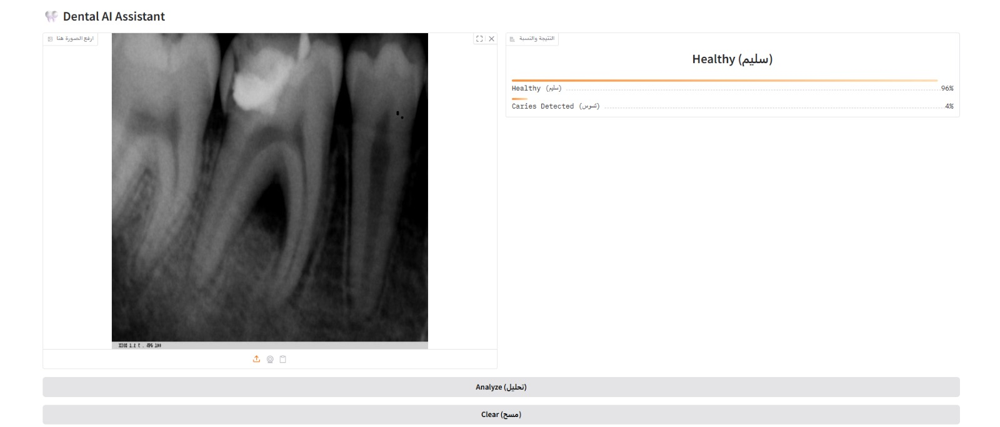

# 🦷 Dental Caries Detection AI Assistant

An end-to-end Deep Learning project designed to detect dental tooth decay from X-ray and clinical images with high precision. This project demonstrates a full AI lifecycle: from model training to cloud deployment.

## 🚀 Live Demo
Check out the interactive web application here:
**[Insert Your Hugging Face Space Link Here]**

---

## 📊 Project Highlights
* **Model Accuracy:** Achieved a stellar **97.6% accuracy** on the test dataset.
* **Core Technology:** Built using **TensorFlow/Keras** for the deep learning backbone (CNN).
* **Deployment:** * **Frontend:** Interactive UI built with **Gradio** for real-time inference.
    * **Backend Support:** Successfully implemented and tested with **FastAPI** for high-performance API logging and request tracking.
    * **Hosting:** Deployed on **Hugging Face Spaces**.

---

## 🛠️ Technical Stack
* **Deep Learning:** TensorFlow, Keras (CNN Architecture)
* **Data Processing:** Pandas, NumPy, PIL (Pillow)
* **Web Frameworks:** Gradio (Current UI), FastAPI (Backend Logic)
* **Database:** SQLite (Used for logging inference history during testing)
* **Version Control:** Git & GitHub

---

## 🔍 How It Works
1.  **Image Pre-processing:** Every uploaded image is automatically converted to **RGB** and resized to **224x224** to ensure consistency across different image formats (PNG, JPG, Grayscale X-rays).
2.  **Inference:** The model predicts the probability of dental caries.
3.  **Real-time Results:** The UI displays a professional **Label view** with confidence scores for both "Healthy" and "Caries Detected" classes.

---

### 🛠️ Challenges & Technical Evolution (The "War Stories")
Building this wasn't easy. I faced several critical issues that required deep troubleshooting:

1. **The "Ghosting" Cache Issue:** Initially, when deploying on Hugging Face, the model would get stuck on the first uploaded image and wouldn't update for the second one. I solved this by forcing a memory refresh using `np.copy()` and restructuring the Gradio interface to clear the state between sessions.
2. **X-ray Format Conflicts:** Standard X-rays are often Grayscale (1-channel), but the model was trained on RGB (3-channels). This caused the server to crash with "Internal Server Errors." I fixed this by implementing an explicit `.convert('RGB')` layer in the preprocessing pipeline.
3. **From FastAPI to Gradio:** I started with a FastAPI backend for logging and request history in SQLite, but for a better user experience, I migrated the final UI to **Gradio Blocks**. This allowed for a more interactive and visually appealing "Label-based" result view.

---

## 🖼️ Application Interface
Below is a look at the final working application in action:



---

## 📁 Project Structure
```bash
├── app/
│   └── app.py              # Main Gradio application script
├── notebooks/
│   └── Training.ipynb      # Model training & evaluation (97% Accuracy)
├── dental_caries_model_v2.h5 # Trained TensorFlow model
├── requirements.txt        # Project dependencies
└── README.md               # Project documentation

---

## 👨‍💻 Developed By
**Mohammad Mahdi Zakar** *Junior Data Scientist | AI Specialist* "Building AI that solves real problems, one bug at a time."